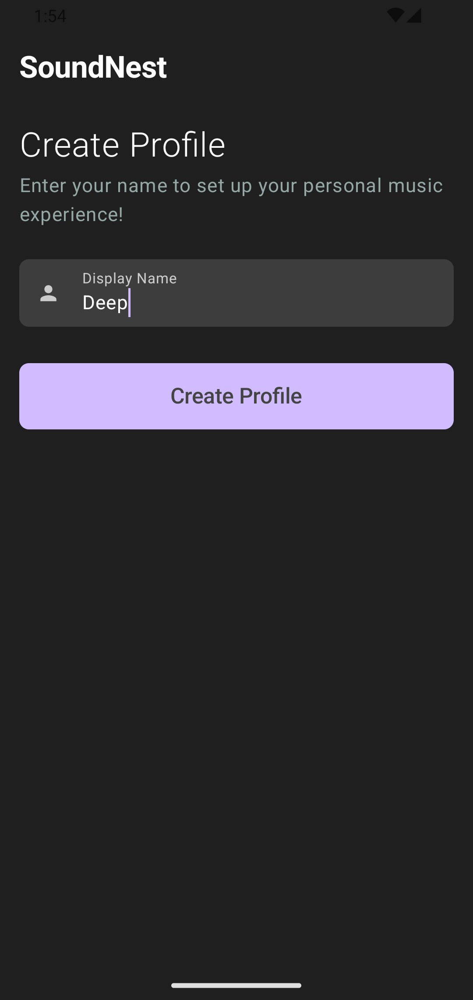
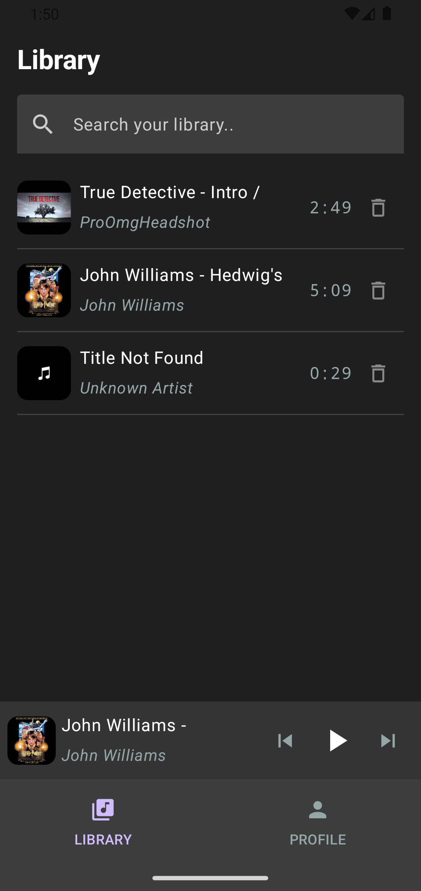
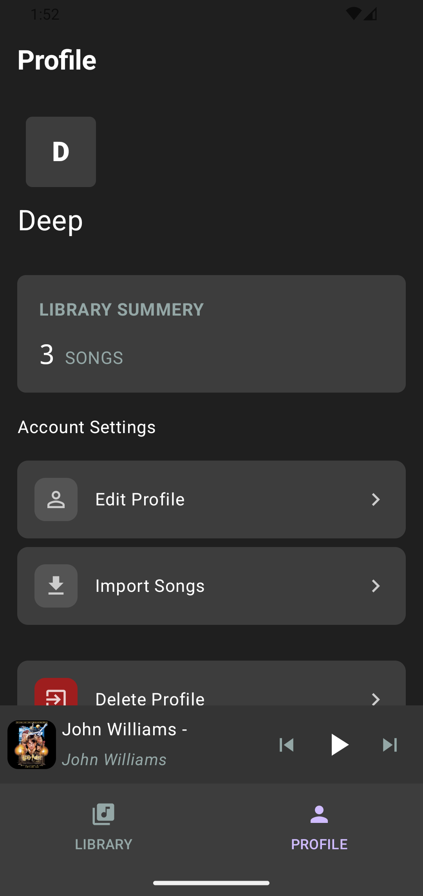
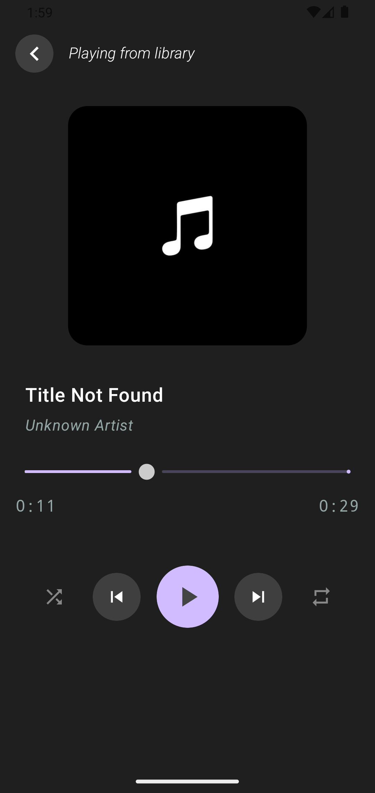
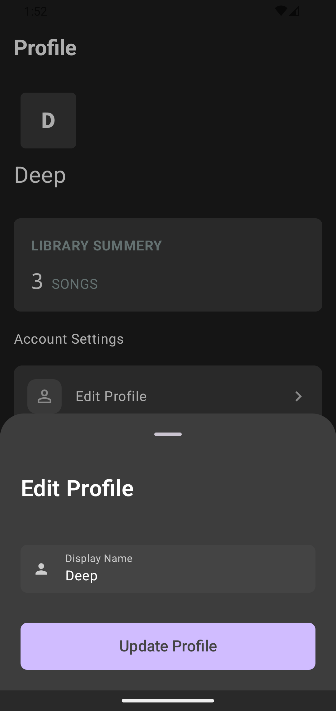

# SoundNest
SoundNest is an offline music player built with **Kotlin**, **Jetpack Compose**, **MVVM**, **Room Database**, and **Media3 (ExoPlayer)**. It lets users import audio files from their device, organize them in a personal library, and play them with a full set of player controls.
> **Note:** App only stores song metadata locally. It does **not** modify or delete the original audio files on your device.

--- 

## Features

### 📂 Library Screen:
* Import songs using Android File Picker
* Store song information locally using Room Database
* Display album artwork
* Search songs by title and artist
* Remove individual songs from the library
  
### 🎧 Music Player Screen:
* Play / Pause
* Previous / Next
* Seek using progress slider
* Display current position and total duration
* Shuffle playback
* Repeat modes (Off, All, One)
  
### 🎵 Mini Player:
* Persistent mini player at the bottom of the screen
* Displays current song title, artist, and album art
* Play/Pause, Previous, and Next controls
* Tap to open the full player screen
  
### 👤 Profile Screen:
* Create local user profile stores only username.
* View total imported songs.
* Edit Profile to edit username.
* Delete profile and clear all local app data.

---

## 🛠 Tech Stack
* Kotlin
* Jetpack Compose
* MVVM Architecture
* Room Database
* Media3 (ExoPlayer)
* Kotlin Coroutines
* StateFlow & Compose State
  
---

## What I Learned
* Building modern Android apps using Jetpack Compose
* MVVM architecture
* Local data persistence with Room Database
* Media playback using Media3 (ExoPlayer)
* State management in Compose
* Building reusable UI components
  
---

## App Screenshots:
  
 
